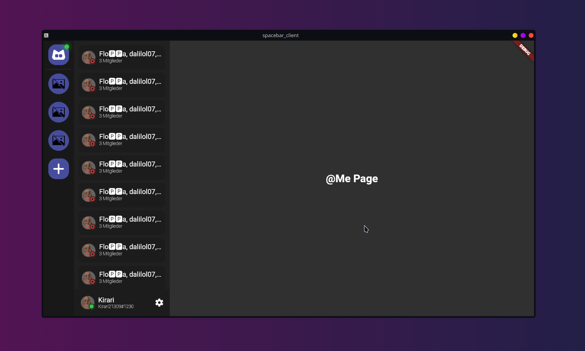

# spacebar_client

An OS Spacebar Chat compatible Client written in Flutter.

## (Unofficial) Api Docs for Spacebar API

[https://documenter.getpostman.com/view/15650779/2s93sf2WSk](https://documenter.getpostman.com/view/15650779/2s93sf2WSk)

## Note

This is only an early version and probably I will never finish it.
